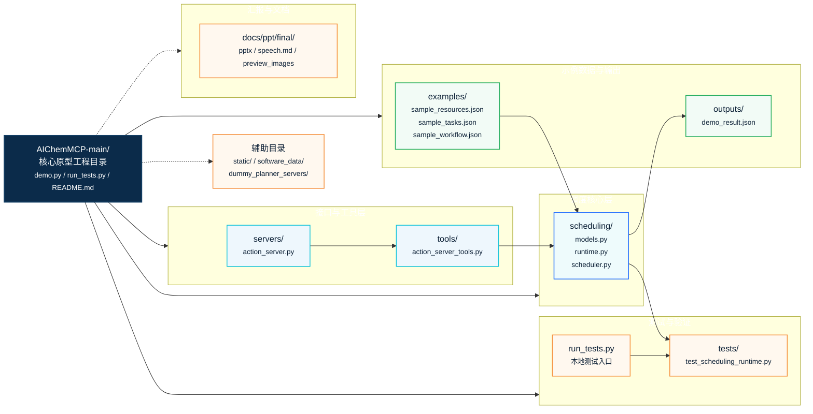

# AIChemMCP 项目目录结构图

> 面向自动化实验室场景的机器人任务调度仿真原型。图中聚焦结题汇报相关主线，省略 `__pycache__`、zip 归档和 IDE 配置等非核心展示项。



## 简洁目录树

```text
AIChemMCP-main/
├─ demo.py                         # demo 演示入口
├─ run_tests.py                    # 本地测试入口
├─ README.md                       # 项目说明
├─ servers/
│  └─ action_server.py             # 工具调用路由
├─ tools/
│  └─ action_server_tools.py       # 调度工具封装
├─ scheduling/
│  ├─ models.py                    # 任务 / 资源数据模型
│  ├─ runtime.py                   # 调度运行时
│  └─ scheduler.py                 # 资源预留与调度逻辑
├─ examples/
│  ├─ sample_resources.json        # mock 工作站与机器人资源
│  ├─ sample_tasks.json            # 示例任务
│  └─ sample_workflow.json         # 示例 workflow
├─ outputs/
│  └─ demo_result.json             # demo 运行结果归档
├─ tests/
│  └─ test_scheduling_runtime.py   # 调度与工具测试
├─ static/                         # 静态资源
├─ software_data/                  # 辅助数据目录
└─ dummy_planner_servers/          # 辅助 planner server 目录
```

## 汇报侧文件

```text
docs/ppt/final/
├─ AIChemMCP_机器人调度结题汇报_v3.pptx
├─ speech.md
├─ preview_images_v3/
├─ project_directory_drawio_style.svg
├─ project_directory_structure.drawio
└─ project_directory_structure.md
```

