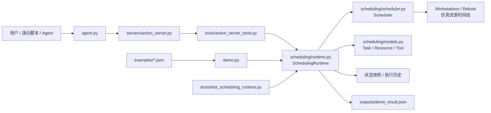
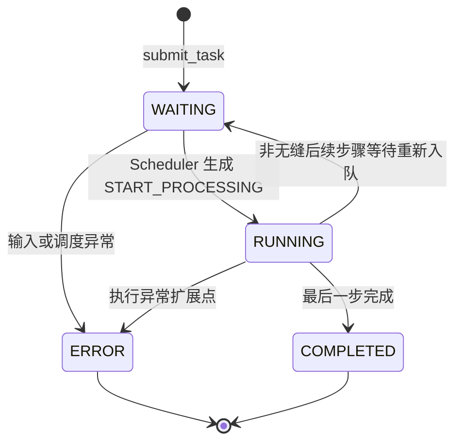
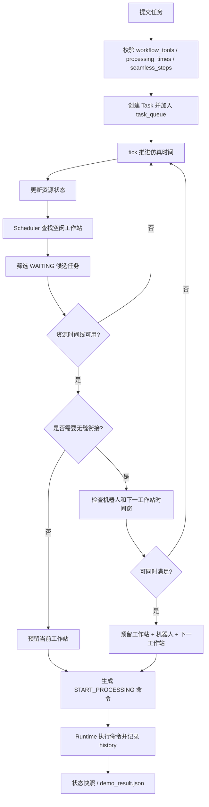
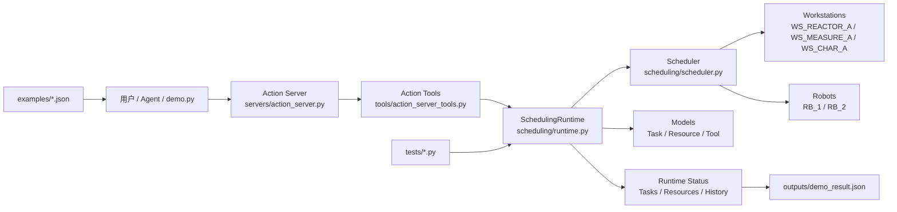
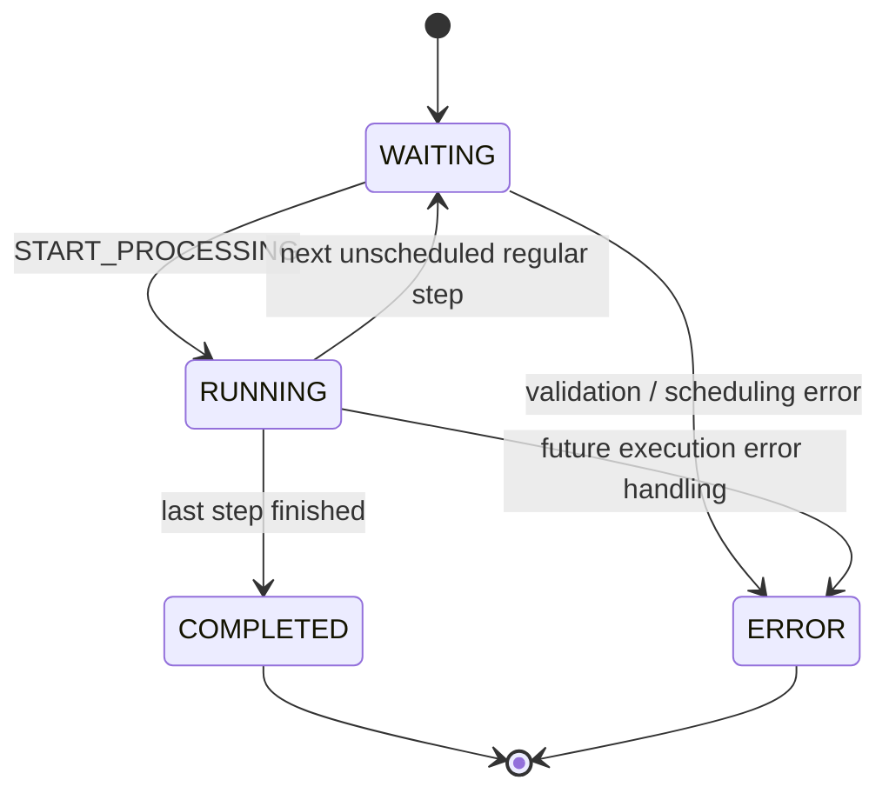
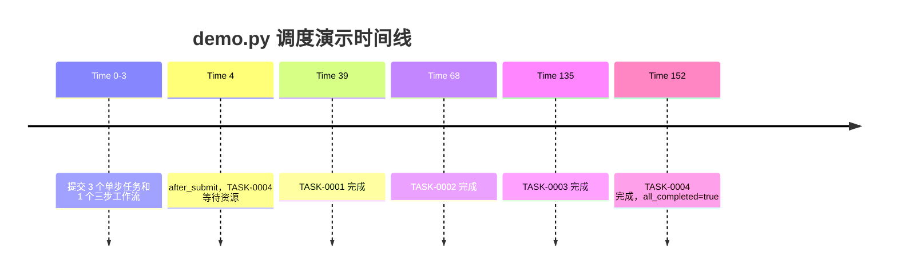

# AIChemMCP 智能调度原型系统结题 PPT 材料包

> 用途：本文件用于后续制作学校工程实践结题汇报 PPT。内容基于当前项目真实代码、README、示例、测试与 demo 输出整理，不生成 PPT，不声明真实硬件已接入。

## 0. 项目事实核查摘要

### 本次核查的主要文件

- 根目录 `README.md`：说明本版本是在原始资料基础上新增的“AIMCP 接入智能调度算法”版本，当前继续开发目录为 `AIChemMCP-main/`。
- `AIChemMCP-main/README.md`：说明当前可运行原型能力、目录结构、快速启动方式和未来扩展方向。
- `AIChemMCP-main/agent.py`：本地 Agent 演示入口，负责启动服务器、发现工具、分发工具调用，并提供 `demo_action_flow()`。
- `AIChemMCP-main/demo.py`：一键调度仿真 demo，读取 examples，提交任务，推进仿真时间，并写出 `outputs/demo_result.json`。
- `AIChemMCP-main/scheduling/models.py`：定义 `Task`、`TaskStatus`、`Resource`、`ResourceStatus`、`Workstation`、`Robot`、`Tool`。
- `AIChemMCP-main/scheduling/scheduler.py`：实现带安全缓冲、资源时间线、机器人转运预留、无缝步骤前瞻检查的调度器。
- `AIChemMCP-main/scheduling/runtime.py`：实现长期存在的调度运行时，封装任务提交、时间推进、状态快照和 demo 所需资源。
- `AIChemMCP-main/servers/action_server.py`：暴露 `robotic_reaction`、`robotic_measurement`、`robotic_characterization`、`scheduler_status`、`scheduler_advance`、`scheduler_run_until_complete` 六个工具。
- `AIChemMCP-main/tools/action_server_tools.py`：将工具调用转换为 `SchedulingRuntime` 方法调用，并返回结构化结果或错误。
- `AIChemMCP-main/examples/`：包含仿真资源、示例任务、三步工作流。
- `AIChemMCP-main/tests/test_scheduling_runtime.py`：包含模型、调度器、运行时、工具错误返回和 demo smoke test。
- `AIChemMCP-main/outputs/demo_result.json`：记录 demo 的任务提交、调度过程、最终状态、资源使用时间线和执行历史。
- `documents/`：包含前期连接方案、智能调度算法说明、中期报告和工作总结等旧资料，可作为背景参考，但本材料以最新代码为准。

### 核查结论

- 当前真正完成的是一个可运行的 AIMCP 智能调度仿真原型，核心代码集中在 `AIChemMCP-main/`。
- `IntelligentScheduling-main/` 是调度算法参考目录，不是本次最新工程化原型的主要运行入口。
- 当前项目未接入真实实验室硬件，所有工作站、机器人、反应、测量、表征均为 simulation / mock。
- 当前没有发现根目录或 `AIChemMCP-main/` 下的 `requirements.txt`；当前测试运行脚本使用 Python 标准库 `unittest`。
- 本次核查执行 `python run_tests.py`，共 8 个测试用例，结果为 `OK`。
- `outputs/demo_result.json` 显示 demo 最终 `all_completed: true`，最终仿真时间为 `152`，4 个任务均完成。

## 1. PPT 推荐页数与整体结构

建议制作 21 页左右，结构如下：

| 页码 | 页面标题 | 页面作用 |
|---|---|---|
| 1 | 封面 | 给出项目名称、课程场景和关键词 |
| 2 | 项目背景 | 说明自动化实验室与 AI for Chemistry 场景 |
| 3 | 项目目标 | 明确本项目是 AIMCP 智能调度仿真原型 |
| 4 | 需求分析 | 展示功能、非功能、演示和工程实践需求 |
| 5 | 系统总体架构 | 用架构图展示 Agent、Action Server、Tools、Runtime、Scheduler |
| 6 | 核心调用链 | 展示从用户/Agent 到调度结果的调用闭环 |
| 7 | 项目目录结构 | 展示工程化目录组织 |
| 8 | 数据模型设计 | 说明 Task、Resource、Workstation、Robot、Tool |
| 9 | 任务状态流转 | 展示任务和资源状态机 |
| 10 | 调度流程设计 | 展示任务提交、资源检查、预留、执行、状态更新 |
| 11 | 工具接口设计 | 展示六个真实工具接口 |
| 12 | 示例任务与资源设计 | 展示 examples 中的仿真资源和任务 |
| 13 | Demo 演示流程 | 展示 demo.py 与 demo_result.json 的闭环 |
| 14 | 关键功能实现 | 展示 3 到 5 个真实实现亮点 |
| 15 | 异常处理与工程健壮性 | 展示输入校验、错误返回、步数限制 |
| 16 | 测试方案 | 展示测试用例、命令和结果 |
| 17 | 工程化实践 | 总结模块化、分层、接口封装、可复现和测试 |
| 18 | 项目成果 | 区分已完成成果与后续可扩展方向 |
| 19 | 项目难点与解决方案 | 总结抽象、解耦、仿真闭环和可测试性 |
| 20 | 不足与展望 | 明确当前是仿真原型，未接硬件 |
| 21 | 总结页 | 收束项目价值、工程思想和演示价值 |

## 2. PPT 页面详细材料

### 第 1 页：封面

**核心观点**

本项目围绕 AIMCP 与智能调度算法集成，完成了一个面向自动化化学实验流程的调度仿真原型。

**页面文字**

- 项目名称：AIChemMCP 智能调度原型系统
- 汇报类型：工程实践结题汇报
- 关键词：AI for Chemistry、AIMCP、Action Server、调度运行时、仿真机器人实验室
- 场景：面向自动化实验流程的任务提交、资源调度与状态反馈
- 小组 / 作者：填写实际小组信息

**建议图片 / 截图 / 图表**

- 自动化实验室或化学实验设备背景图。
- 可叠加简洁关键词：Agent、Scheduler、Robot、Workstation。

**视觉表现方式**

- 大图背景 + 半透明标题区域。
- 主色建议使用深蓝、青色、深灰，保持清爽科技感。

**给 PPT 生成工具的页面描述**

制作一页科技感封面，以自动化化学实验室为背景，标题突出“AIChemMCP 智能调度原型系统”，副标题为“工程实践结题汇报”，下方放置项目关键词和小组信息占位符。

### 第 2 页：项目背景

**核心观点**

自动化实验室需要把高层实验目标转化为可执行的任务流程，并在有限设备资源之间完成调度。

**页面文字**

- AI for Chemistry 场景中，实验任务不只需要“规划做什么”，还需要“安排何时、在哪里、由哪些资源执行”。
- 自动化实验室通常包含反应工作站、测量工作站、表征工作站和样品转运机器人。
- 多任务并发时，工作站与机器人会产生资源竞争，需要调度系统维护任务状态和资源占用。
- 本项目选择先完成可验证的仿真调度闭环，为后续真实硬件协议接入预留结构。

**建议图片 / 截图 / 图表**

- 自动化实验室流程示意图。
- 一张“用户目标 -> 实验任务 -> 资源调度 -> 状态反馈”的简图。

**视觉表现方式**

- 左侧放背景问题，右侧放项目切入点。
- 用 3 个小卡片表示“实验任务”“设备资源”“调度执行”。

**给 PPT 生成工具的页面描述**

制作一页背景说明页，强调自动化实验流程需要从 AI 规划走向资源调度执行，使用流程图和 3 个卡片展示实验任务、设备资源、调度执行三个关键词。

### 第 3 页：项目目标

**核心观点**

构建一个 AIMCP 智能调度仿真原型，使 Agent 工具调用能够进入调度运行时，并形成任务状态反馈闭环。

**页面文字**

- 实验任务抽象：将反应、测量、表征封装为可调度任务。
- 设备资源抽象：用 Workstation、Robot、Tool 表示仿真实验室资源。
- 调度运行时：长期维护当前时间、任务队列、资源状态和执行历史。
- 工具接口调用：通过 Action Server 暴露六个可调用工具。
- 状态查询与推进：支持 `scheduler_status`、`scheduler_advance`、`scheduler_run_until_complete`。
- Demo 与测试验证：提供 `demo.py`、`outputs/demo_result.json` 和 `run_tests.py`。

**建议图片 / 截图 / 图表**

- 项目目标矩阵。
- README 中 Quick Start 与 Current Completion 部分截图。

**视觉表现方式**

- 目标拆成六个模块卡片，中心放“调度仿真闭环”。

**给 PPT 生成工具的页面描述**

制作目标页，中心为“AIMCP 智能调度仿真闭环”，周围用六个模块卡片展示任务抽象、资源抽象、调度运行时、工具接口、状态查询、demo 与测试验证。

### 第 4 页：需求分析

**核心观点**

本项目需求不是单点算法演示，而是要完成从接口、模型、调度、状态、demo 到测试的工程化闭环。

**页面文字**

| 需求类型 | 具体内容 | 当前实现情况 |
|---|---|---|
| 功能需求 | 提交反应、测量、表征任务；查询状态；推进时间；运行到完成 | 已通过 Action Server 与 Runtime 实现 |
| 非功能需求 | 结构清晰、可测试、可复现、错误可返回 | 已通过分层代码、unittest、结构化响应支持 |
| 展示需求 | 一键运行 demo，生成可截图的过程与结果 | 已通过 `demo.py` 和 `outputs/demo_result.json` 支持 |
| 工程实践需求 | 模块化、分层、接口封装、文档化、仿真与硬件解耦 | 已在目录结构和代码边界中体现 |

**建议图片 / 截图 / 图表**

- 需求分类表。
- 可以放一个“需求 -> 实现文件”的映射小图。

**视觉表现方式**

- 使用四象限或表格。
- 每类需求配一个简洁图标。

**给 PPT 生成工具的页面描述**

制作需求分析页，用四象限或表格展示功能需求、非功能需求、展示需求、工程实践需求，并在每项后面标注当前代码中对应的实现模块。

### 第 5 页：系统总体架构

**核心观点**

系统采用 Agent / Action Server / Tools / SchedulingRuntime / Scheduler 的分层结构，将高层工具调用与底层调度逻辑解耦。

**页面文字**

- `agent.py`：本地演示 Agent，启动服务器、发现工具、发送 JSON-RPC 工具调用。
- `servers/action_server.py`：Action Server 网关，负责工具声明、请求解析和路由。
- `tools/action_server_tools.py`：工具实现层，将外部动作请求转换为运行时任务提交或状态操作。
- `scheduling/runtime.py`：调度运行时，维护任务、时间、资源、执行历史和状态快照。
- `scheduling/scheduler.py`：核心调度器，负责资源时间线、预留和调度命令生成。
- `scheduling/models.py`：任务、资源、工具等核心数据模型。
- `examples/`、`tests/`、`outputs/`：分别提供数据驱动示例、验证用例和结果归档。

**适合 PPT 的 Mermaid 架构图**



**建议图片 / 截图 / 图表**

- Mermaid 架构图。
- 项目目录截图可作为右下角辅助。

**视觉表现方式**

- 分层架构图，左侧调用入口，中间服务与工具，右侧调度核心和输出。

**给 PPT 生成工具的页面描述**

制作系统架构页，使用横向分层流程图展示 User/Agent、Action Server、Tools、SchedulingRuntime、Scheduler、Models、Examples、Tests、Outputs 的关系，突出“接口层与调度层解耦”。

### 第 6 页：核心调用链

**核心观点**

项目已经跑通“用户 / Agent 发起工具调用 -> Action Server 接收 -> Runtime 调度 -> Scheduler 生成命令 -> 状态反馈”的闭环。

**页面文字**

核心调用链：

```text
用户 / Agent
  -> 工具接口 robotic_reaction / robotic_measurement / robotic_characterization
  -> Action Server 路由
  -> ActionServerTools 参数转换与异常封装
  -> SchedulingRuntime 提交任务或推进时间
  -> Scheduler 检查资源时间线并生成 START_PROCESSING 命令
  -> Runtime 更新任务状态、资源状态和执行历史
  -> scheduler_status / demo_result.json 返回状态快照
```

真实文件路径：

- `AIChemMCP-main/agent.py`
- `AIChemMCP-main/servers/action_server.py`
- `AIChemMCP-main/tools/action_server_tools.py`
- `AIChemMCP-main/scheduling/runtime.py`
- `AIChemMCP-main/scheduling/scheduler.py`

**建议图片 / 截图 / 图表**

- 调用链流程图。
- `agent.py` 中 `demo_action_flow()` 代码截图。
- `action_server.py` 中 `AVAILABLE_TOOLS_ACTION` 截图。

**视觉表现方式**

- 用箭头串联 6 个步骤。
- 每个步骤下方放一个真实文件名。

**给 PPT 生成工具的页面描述**

制作核心调用链页，使用一条横向箭头链路展示用户/Agent 到调度结果的全过程，每个节点标注真实文件名和职责，强调闭环已经可运行。

### 第 7 页：项目目录结构

**核心观点**

当前项目已经从概念方案整理为具有入口、模块、示例、测试和输出归档的工程化目录。

**页面文字**

简化目录树：

```text
项目根目录/
  README.md
  docs/
    ppt_materials.md
  documents/
    AIMCP与智能调度算法模块连接方案.md
    智能调度算法说明.md
    reports/
  AIChemMCP-main/
    README.md
    agent.py
    demo.py
    run_tests.py
    scheduling/
      models.py
      scheduler.py
      runtime.py
    servers/
      action_server.py
    tools/
      action_server_tools.py
    examples/
      sample_resources.json
      sample_tasks.json
      sample_workflow.json
    tests/
      test_scheduling_runtime.py
    outputs/
      demo_result.json
  IntelligentScheduling-main/
    src/
    documents/
```

说明：

- `AIChemMCP-main/` 是当前可运行原型主目录。
- `IntelligentScheduling-main/` 作为算法参考资料保留。
- 根目录 `documents/` 保存前期方案和报告，不作为当前运行入口。

**建议图片 / 截图 / 图表**

- VS Code / 文件管理器目录树截图。
- 可以用目录树图形化展示，不必列所有旧文件。

**视觉表现方式**

- 左侧目录树，右侧用 4 个标签解释“入口、核心模块、验证、输出”。

**给 PPT 生成工具的页面描述**

制作目录结构页，展示简化项目目录树，重点突出 AIChemMCP-main 下的 agent、demo、scheduling、servers、tools、examples、tests、outputs，并标注当前主运行目录。

### 第 8 页：数据模型设计

**核心观点**

项目通过 `Task`、`Resource`、`Workstation`、`Robot`、`Tool` 把化学实验流程转化为可调度的数据结构。

**页面文字**

真实模型来自 `AIChemMCP-main/scheduling/models.py`：

- `Task`
  - `id`：任务编号，如 `TASK-0001`
  - `workflow_tools`：任务步骤使用的工具序列
  - `processing_times`：每个工具对应的处理时长
  - `seamless_steps`：需要无缝衔接的相邻步骤
  - `sample_id`：样品编号
  - `metadata`：任务类型、配方、测量方法等扩展信息
  - `status`、`current_step`、`next_step_scheduled`
- `TaskStatus`
  - `WAITING`
  - `RUNNING`
  - `COMPLETED`
  - `ERROR`
- `Resource`
  - `id`
  - `status`
  - `timeline`
  - `current_task_id`
- `ResourceStatus`
  - `IDLE`
  - `BUSY`
  - `RESERVED`
  - `COMPLETED_WAITING_FOR_PICKUP`
  - `MOVING_TO_PICKUP`
  - `TRANSPORTING`
  - `ERROR`
- `Workstation`
  - 继承 `Resource`
  - 增加 `tools`
- `Robot`
  - 继承 `Resource`
- `Tool`
  - `id`

**建议图片 / 截图 / 图表**

- UML 风格类图。
- `models.py` 中模型定义截图。

**视觉表现方式**

- 中间放 Task，右侧放 Resource，Resource 分出 Workstation 和 Robot。
- 用小标签展示枚举状态。

**给 PPT 生成工具的页面描述**

制作数据模型页，用类图形式展示 Task、Resource、Workstation、Robot、Tool 的关系，标注核心字段和状态枚举，突出实验任务和设备资源都被统一抽象为可调度对象。

### 第 9 页：任务状态流转

**核心观点**

任务状态从等待进入运行，最后完成；异常输入或调度错误会通过 `ValueError` 或结构化错误返回暴露。

**页面文字**

真实任务状态：

- `WAITING`：任务已创建并进入队列，等待调度或资源可用。
- `RUNNING`：任务当前步骤已被工作站执行，或已预留下一步处理。
- `COMPLETED`：任务所有步骤完成。
- `ERROR`：模型中预留的错误状态，目前主要通过异常和错误响应进行基础处理。

资源状态更细，包括：

- `IDLE`：空闲
- `BUSY`：工作站正在处理
- `RESERVED`：未来时间窗已预留
- `COMPLETED_WAITING_FOR_PICKUP`：工作站完成但等待机器人取样
- `MOVING_TO_PICKUP`：机器人前往取样
- `TRANSPORTING`：机器人转运样品
- `ERROR`：错误状态

**适合 PPT 的 Mermaid 状态图**



**建议图片 / 截图 / 图表**

- Mermaid 状态图。
- `outputs/demo_result.json` 中 `final_task_status` 截图。

**视觉表现方式**

- 主图用状态流转图。
- 右侧用 demo 最终 `COMPLETED` 结果证明状态闭环。

**给 PPT 生成工具的页面描述**

制作状态流转页，使用 Mermaid 状态图展示 WAITING、RUNNING、COMPLETED、ERROR，并用一块侧栏列出资源状态，强调 demo 输出中的任务最终都进入 COMPLETED。

### 第 10 页：调度流程设计

**核心观点**

调度器基于资源时间线进行可用性检查，并通过预留机制处理普通任务和无缝衔接任务。

**页面文字**

调度核心流程来自 `SchedulingRuntime` 和 `Scheduler`：

1. 工具或 demo 提交任务。
2. Runtime 校验 `workflow_tools`、`processing_times`、`seamless_steps`。
3. Runtime 创建 `Task` 并加入 Scheduler 队列。
4. Runtime 调用 `tick()` 推进仿真时间。
5. Scheduler 查找空闲工作站。
6. Scheduler 为候选任务解析目标工作站和处理时长。
7. Scheduler 检查工作站时间线是否可用。
8. 对无缝步骤，进一步检查机器人可用时间和下一工作站时间窗。
9. 调度成功后生成 `START_PROCESSING` 命令。
10. Runtime 执行命令并更新任务状态、资源状态和执行历史。
11. `advance_time()` 或 `run_until_all_complete()` 持续推进直到任务完成。

**适合 PPT 的 Mermaid 流程图**



**建议图片 / 截图 / 图表**

- Mermaid 流程图。
- `scheduler.py` 中 `_reserve_step()` 和 `schedule()` 截图。

**视觉表现方式**

- 主视觉为流程图。
- 用颜色区分“任务提交”“资源检查”“预留执行”“结果输出”。

**给 PPT 生成工具的页面描述**

制作调度流程页，使用垂直流程图展示从任务提交、参数校验、入队、时间推进、资源检查、预留、命令生成到状态输出的完整过程，重点突出时间线可用性检查和无缝步骤前瞻预留。

### 第 11 页：工具接口设计

**核心观点**

Action Server 暴露了六个真实工具接口，覆盖任务提交、状态查询、时间推进和运行到完成。

**页面文字**

真实接口来自 `AIChemMCP-main/servers/action_server.py` 和 `AIChemMCP-main/tools/action_server_tools.py`：

| 工具接口 | 功能 | 输入 | 输出 | 异常处理 | PPT 展示建议 |
|---|---|---|---|---|---|
| `robotic_reaction` | 提交反应任务 | `recipe`、`vessel_id` | `ok`、message、result、runtime_status | recipe 必须为对象，vessel_id 必须为非空字符串 | 展示“反应任务 -> reaction_tool -> WS_REACTOR_A” |
| `robotic_measurement` | 提交测量任务 | `sample_id`、`measurement_type` | 结构化任务结果和状态快照 | sample_id 非空；measurement_type 仅支持 `yield`、`ph` | 展示“样品测量 -> yield/ph 工具” |
| `robotic_characterization` | 提交表征任务 | `sample_id`、`analysis_method` | 结构化任务结果和状态快照 | analysis_method 支持 `HPLC`、`NMR`、`GENERAL` | 展示“表征 -> HPLC/NMR/通用表征” |
| `scheduler_status` | 查询当前调度状态 | 无 | `runtime_status` | 无复杂输入，直接返回状态快照 | 展示任务表、资源表、时间线 |
| `scheduler_advance` | 推进仿真时间 | `steps`，默认 1 | advanced_steps、current_time、completion_events、runtime_status | steps 必须为正整数 | 展示“单步/多步推进” |
| `scheduler_run_until_complete` | 运行至任务完成或步数上限 | `max_steps`，默认 1000 | steps_run、all_completed、completion_events、runtime_status | max_steps 必须为正整数 | 展示 demo 最终闭环 |

Action 工具统一返回：

- 成功：`ok: true`、`message`、`result`、`runtime_status`
- 失败：`ok: false`、`error.code: INVALID_INPUT`、`input`、`runtime_status`

**建议图片 / 截图 / 图表**

- `action_server.py` 中工具列表截图。
- `action_server_tools.py` 中 `_safe_call()` 和 `_error_response()` 截图。

**视觉表现方式**

- 用接口矩阵表。
- 每个接口前可以放小图标：反应、测量、表征、状态、时钟、完成。

**给 PPT 生成工具的页面描述**

制作工具接口页，使用表格列出六个真实接口的功能、输入、输出和异常处理，突出接口统一返回结构和 runtime_status 状态快照。

### 第 12 页：示例任务与资源设计

**核心观点**

examples 目录提供了可复现 demo 所需的仿真资源、单步任务和三步工作流。

**页面文字**

示例资源来自 `examples/sample_resources.json`：

- 3 个工作站：
  - `WS_REACTOR_A`：`reaction_tool`
  - `WS_MEASURE_A`：`yield_measurement_tool`、`ph_measurement_tool`
  - `WS_CHAR_A`：`hplc_tool`、`nmr_tool`、`characterization_tool`
- 2 个机器人：
  - `RB_1`：样品转运机器人
  - `RB_2`：备用转运机器人

示例任务来自 `examples/sample_tasks.json`：

- `demo_reaction_001`：反应任务，配方为 `esterification_screen`，估计时长 24。
- `demo_measurement_001`：收率测量任务，样品为 `SAMPLE-REF-001`。
- `demo_characterization_001`：HPLC 表征任务，样品为 `SAMPLE-REF-002`。

三步工作流来自 `examples/sample_workflow.json`：

- `workflow_tools`：`reaction_tool -> yield_measurement_tool -> hplc_tool`
- `processing_times`：18、12、16
- `seamless_steps`：`[[0, 1]]`
- `metadata.simulation_only: true`

真实性提醒：

- `sample_tasks.json` 中的 `depends_on` 字段存在于示例数据中，但当前通用运行时没有把它作为任务依赖调度约束执行。
- 多步衔接的真实演示主要来自 `sample_workflow.json` 中的 `workflow_tools` 和 `seamless_steps`。

**建议图片 / 截图 / 图表**

- `sample_resources.json` 与 `sample_workflow.json` 局部截图。
- 资源与任务映射图。

**视觉表现方式**

- 左侧显示资源卡片，右侧显示任务卡片，中间用箭头关联工具与工作站。

**给 PPT 生成工具的页面描述**

制作示例设计页，展示 3 个仿真工作站、2 个仿真机器人、3 个单步任务和 1 个三步工作流，用资源卡片和任务卡片说明 demo 数据如何驱动调度运行。

### 第 13 页：Demo 演示流程

**核心观点**

`demo.py` 提供一键可运行演示，最终输出证明任务提交、调度推进、状态更新、结果归档已经形成闭环。

**页面文字**

启动命令：

```powershell
cd AIChemMCP-main
python demo.py
```

demo 执行流程：

1. 读取 `examples/sample_resources.json`、`sample_tasks.json`、`sample_workflow.json`。
2. 创建 `SchedulingRuntime()`。
3. 依次提交反应、测量、表征三个单步任务。
4. 额外提交三步集成工作流 `demo_three_step_flow`。
5. 打印任务表和资源表。
6. `advance_time(steps=35)` 推进仿真时间。
7. `run_until_all_complete(max_steps=500)` 运行至完成。
8. 将结果写入 `outputs/demo_result.json`。

demo 输出关键信息：

- `demo_mode: simulation`
- 提交任务数：4
- `all_completed: true`
- 最终仿真时间：152
- 资源使用：
  - `WS_REACTOR_A` 处理 `TASK-0001`、`TASK-0004`
  - `WS_MEASURE_A` 处理 `TASK-0002`、`TASK-0004`
  - `WS_CHAR_A` 处理 `TASK-0003`、`TASK-0004`
  - `RB_1` 为 `TASK-0004` 执行两段转运
  - `RB_2` 当前 demo 中未实际使用

**建议图片 / 截图 / 图表**

- `python demo.py` 控制台运行截图。
- `outputs/demo_result.json` 中 `all_completed`、`final_task_status`、`resource_usage` 截图。
- 可以画一条 demo 时间线。

**视觉表现方式**

- 用时间线展示 Submit -> Advance -> Final -> Output。
- 右侧放 JSON 结果截图，突出 `all_completed: true`。

**给 PPT 生成工具的页面描述**

制作 demo 流程页，使用横向时间线展示 demo.py 从读取示例、提交任务、推进时间、运行到完成、写出 demo_result.json 的过程，并用重点标注展示 all_completed true、simulation_time 152 和 4 个任务完成。

### 第 14 页：关键功能实现

**核心观点**

项目的关键工作不只是写了一个 demo，而是把模型、调度器、运行时、工具接口和测试组合成了可运行系统。

**页面文字**

| 关键功能 | 实现说明 | 对应文件 |
|---|---|---|
| 调度运行时封装 | `SchedulingRuntime` 长期维护时间、任务计数器、样品计数器、资源、调度器和执行历史 | `AIChemMCP-main/scheduling/runtime.py` |
| 任务与资源模型 | `Task` 支持 workflow_tools、processing_times、seamless_steps；Resource 支持 timeline | `AIChemMCP-main/scheduling/models.py` |
| 资源时间线与预留 | Scheduler 检查工作站和机器人时间线，生成预留并输出 `START_PROCESSING` 命令 | `AIChemMCP-main/scheduling/scheduler.py` |
| 工具接口结构化返回 | `ActionServerTools` 将请求转换为 Runtime 调用，并统一返回 success/error 与 runtime_status | `AIChemMCP-main/tools/action_server_tools.py` |
| Demo 输出归档 | `demo.py` 生成最终结果，写入 `outputs/demo_result.json`，包含任务、过程、资源使用和历史 | `AIChemMCP-main/demo.py` |
| 测试覆盖 | 覆盖模型创建、调度预留、运行时推进、非法输入、工具错误、demo 输出 | `AIChemMCP-main/tests/test_scheduling_runtime.py` |

**建议图片 / 截图 / 图表**

- 每个关键功能对应一个代码截图。
- 可用“功能 -> 文件 -> 结果”的三列表。

**视觉表现方式**

- 5 到 6 张功能卡片。
- 每张卡片底部放真实文件路径，增强可信度。

**给 PPT 生成工具的页面描述**

制作关键实现页，用功能卡片展示调度运行时、数据模型、资源预留、工具返回、demo 输出和测试覆盖，每张卡片都标注真实文件路径。

### 第 15 页：异常处理与工程健壮性

**核心观点**

当前项目已经实现基础输入校验和结构化错误返回，后续仍可继续增强真实硬件异常、重试和恢复。

**页面文字**

已实现的基础异常处理：

- 任务模型要求必须提供 `workflow` 或 `workflow_tools`，否则抛出 `ValueError`。
- `workflow_tools` 必须是非空列表。
- 未知工具会被拒绝，例如不存在于 `tool_to_workstation_map` 的工具。
- `processing_times` 必须是对象，并覆盖所有工作流工具。
- 处理时长、推进步数、最大步数必须为正整数。
- `seamless_steps` 必须是相邻合法步骤。
- `sample_id`、`vessel_id`、`measurement_type`、`analysis_method` 等文本字段必须非空。
- `measurement_type` 当前只支持 `yield`、`ph`。
- `analysis_method` 当前支持 `HPLC`、`NMR`、`GENERAL`。
- Action Server 对非 JSON object 参数返回 `INVALID_PARAMS`。
- `ActionServerTools` 捕获运行时异常并返回 `ok: false`、`error.code: INVALID_INPUT`。

需要如实说明的限制：

- `TaskStatus.ERROR` 与 `ResourceStatus.ERROR` 已在模型中定义，但真实错误恢复流程尚未完整实现。
- 当前未接真实硬件，因此没有设备 ACK、断连重试、硬件超时恢复等机制。
- 当前资源不可用时，调度器会等待后续时间推进，不是复杂的全局重规划系统。

**建议图片 / 截图 / 图表**

- `runtime.py` 中 `_require_text()`、`_positive_int()`、`_validate_workflow_tools()` 截图。
- `action_server_tools.py` 中 `_error_response()` 截图。

**视觉表现方式**

- 左侧“已实现”，右侧“后续增强”。
- 使用绿色勾选和灰色待扩展标签。

**给 PPT 生成工具的页面描述**

制作工程健壮性页，左侧列出已实现的输入校验和结构化错误返回，右侧列出待增强的真实硬件 ACK、恢复、重试和重调度机制，避免夸大当前能力。

### 第 16 页：测试方案

**核心观点**

测试覆盖了模型、调度器、运行时、工具错误返回和 demo smoke test，验证当前原型可运行。

**页面文字**

测试命令：

```powershell
cd AIChemMCP-main
python run_tests.py
```

测试结果：

```text
Ran 8 tests
OK
```

测试用例表：

| 测试编号 | 测试对象 | 测试内容 | 预期结果 | 实际结果 |
|---|---|---|---|---|
| T01 | Task 模型 | 创建单步 `reaction_tool` 任务 | 初始状态为 `WAITING`，总步数为 1 | 通过 |
| T02 | Task 模型 | 不提供 workflow 或 workflow_tools | 抛出 `ValueError` | 通过 |
| T03 | Scheduler | 单工作站单任务调度 | 生成 1 条命令并写入时间线 | 通过 |
| T04 | Runtime | 提交反应任务并运行至完成 | 任务最终 `COMPLETED` | 通过 |
| T05 | Runtime | 推进仿真时间 | 返回 `ok: true`，时间正确增加 | 通过 |
| T06 | Runtime | 非法输入 | 空 sample_id 和 steps=0 被拒绝 | 通过 |
| T07 | ActionServerTools | 工具非法输入 | 返回 `ok: false` 和 `INVALID_INPUT` | 通过 |
| T08 | Demo smoke test | 运行 `demo.run_demo()` 并生成输出 | `all_completed: true`，结果文件存在 | 通过 |

测试范围：

- 数据模型基础约束。
- 调度器基础资源预留。
- 运行时任务提交、时间推进、完成状态。
- 工具层结构化错误。
- demo 输出文件生成。

**建议图片 / 截图 / 图表**

- 测试终端截图。
- `tests/test_scheduling_runtime.py` 截图。

**视觉表现方式**

- 用测试用例表 + 右上角测试通过徽章。
- 终端截图可作为真实验证证据。

**给 PPT 生成工具的页面描述**

制作测试方案页，展示测试命令、Ran 8 tests OK 的结果和测试用例表，强调测试覆盖模型、调度器、运行时、工具层和 demo smoke test。

### 第 17 页：工程化实践

**核心观点**

项目体现了模块化、分层架构、接口封装、数据驱动演示、可复现 demo、自动测试和仿真硬件解耦等软件工程思想。

**页面文字**

工程化体现：

- 模块化设计：`scheduling/`、`servers/`、`tools/`、`examples/`、`tests/`、`outputs/` 职责明确。
- 分层架构：Agent 负责调用入口，Action Server 负责协议与路由，Tools 负责业务接口，Runtime 负责状态管理，Scheduler 负责调度决策。
- 接口封装：外部只通过工具接口提交任务和查询状态，内部调度细节被封装在运行时和调度器中。
- 数据驱动示例：demo 从 JSON 示例读取资源、任务和工作流，便于修改和复现。
- 可复现演示：`python demo.py` 一条命令即可生成标准输出与 JSON 结果。
- 测试验证：`python run_tests.py` 执行标准库测试，不依赖复杂环境。
- 输出归档：demo 结果保存到 `outputs/demo_result.json`，便于截图、复查和汇报。
- mock / simulation 与真实硬件解耦：当前以仿真资源完成闭环，后续可替换真实设备协议。

**建议图片 / 截图 / 图表**

- 工程化能力雷达图。
- “分层架构 + 可测试 + 可复现 + 可扩展”四块卡片。

**视觉表现方式**

- 用 8 个短卡片展示工程实践点。
- 中心放“工程化闭环”，周围放实践要素。

**给 PPT 生成工具的页面描述**

制作工程化实践页，用卡片或雷达图展示模块化、分层架构、接口封装、数据驱动、demo 可复现、测试验证、文档化和仿真解耦，语言正式，适合作为老师认可的工程实践总结页。

### 第 18 页：项目成果

**核心观点**

当前项目已经完成可运行仿真原型、工具接口、调度运行时、示例数据、测试用例和输出归档，但真实硬件接入仍属于后续扩展。

**页面文字**

已完成成果：

- 可运行 demo：`AIChemMCP-main/demo.py`
- Agent 演示入口：`AIChemMCP-main/agent.py`
- 调度原型：`AIChemMCP-main/scheduling/`
- Action Server 工具接口：`AIChemMCP-main/servers/action_server.py`
- 工具实现封装：`AIChemMCP-main/tools/action_server_tools.py`
- 示例数据：`AIChemMCP-main/examples/`
- 测试用例：`AIChemMCP-main/tests/test_scheduling_runtime.py`
- 结果归档：`AIChemMCP-main/outputs/demo_result.json`
- 文档材料：`README.md`、`AIChemMCP-main/README.md`、`documents/`、`docs/ppt_materials.md`

后续可扩展成果：

- 接入真实硬件或硬件仿真平台。
- 增加真实设备 ACK 与异常恢复。
- 支持更复杂的多步实验依赖和反馈闭环。
- 引入更复杂的调度策略或全局优化。
- 增加可视化界面和运行监控看板。
- 与大模型实验规划结果形成更强的自动闭环。

**建议图片 / 截图 / 图表**

- 成果清单卡片。
- demo 最终完成 JSON 截图。

**视觉表现方式**

- 页面分成“真实完成”和“后续扩展”两栏。
- 已完成内容用实色，扩展内容用浅色虚线框。

**给 PPT 生成工具的页面描述**

制作项目成果页，清晰分成已完成和后续可扩展两栏，已完成部分列出真实文件和运行结果，后续扩展部分标注为未来方向。

### 第 19 页：项目难点与解决方案

**核心观点**

项目难点集中在实验任务抽象、Agent 与调度器解耦、无硬件条件下闭环演示、状态可观测和测试验证。

**页面文字**

| 难点 | 具体问题 | 解决方案 |
|---|---|---|
| 化学实验任务抽象 | 反应、测量、表征语义不同，难以直接进入统一调度器 | 通过 `workflow_tools`、`processing_times`、`metadata` 把任务转为统一 `Task` |
| Agent 与调度器解耦 | Agent 不应直接操作工作站和机器人细节 | 通过 Action Server 与 Tools 层作为接口网关，Runtime 维护调度状态 |
| 无真实硬件条件下完成闭环 | 没有真实机器人和工作站，难以展示执行 | 用仿真 Workstation / Robot、时间线和 demo 输出替代真实硬件执行 |
| 多资源时间冲突 | 多任务会竞争工作站和机器人 | Scheduler 使用 `timeline` 检查资源时间窗并进行预留 |
| 工程可测试性 | 不能只停留在概念图和文档 | 提供 `run_tests.py`、unittest 用例和 demo smoke test |

**建议图片 / 截图 / 图表**

- “难点 -> 方案 -> 代码文件”的三段式图。

**视觉表现方式**

- 使用 5 行问题解决表。
- 每个解决方案下标注一个文件路径。

**给 PPT 生成工具的页面描述**

制作项目难点页，用表格展示 5 个真实难点及解决方案，突出工程实现不是只停留在概念层，而是有具体代码、demo 和测试支撑。

### 第 20 页：不足与展望

**核心观点**

当前系统定位为仿真原型，已验证软件结构和调度闭环；真实硬件、复杂反馈、可视化和高级算法是后续方向。

**页面文字**

当前不足：

- 当前是仿真调度原型，不是已接入真实实验室硬件的生产系统。
- 工作站和机器人是模拟资源，未连接真实设备协议。
- 暂未实现真实设备 ACK、异常恢复、超时重试和安全联锁。
- `sample_tasks.json` 中的通用 `depends_on` 字段尚未成为完整依赖调度机制。
- 暂未实现复杂多步实验反馈闭环，例如根据测量结果自动调整下一步实验。
- 暂未提供可视化监控界面。
- 调度策略以可解释、可演示为主，尚未引入复杂全局优化算法。

后续展望：

- 接入真实设备协议或更完整的硬件仿真平台。
- 增加设备回执和运行异常恢复机制。
- 完善多任务依赖、样品追踪和实验结果反馈闭环。
- 引入更复杂调度算法，例如优先级、最短处理时间、全局优化或重调度。
- 增加 Web 可视化界面，展示任务队列、资源时间线和状态变化。
- 将 LLM 规划与调度反馈结合，形成更完整的 AI 实验编排系统。

**建议图片 / 截图 / 图表**

- 当前能力与未来能力路线图。
- 原型 -> 硬件接入 -> 智能优化 -> 可视化平台 的阶段图。

**视觉表现方式**

- 左侧“当前边界”，右侧“后续路线”。
- 使用时间线或阶梯式路线图。

**给 PPT 生成工具的页面描述**

制作不足与展望页，明确说明当前系统是仿真原型，未接真实硬件，并用路线图展示后续硬件协议、异常恢复、复杂调度、可视化界面和 LLM 自动规划方向。

### 第 21 页：总结页

**核心观点**

本项目完成了从 AIMCP 工具调用到调度仿真执行的工程化闭环，为后续真实实验室调度系统打下了结构基础。

**页面文字**

- 完成内容：构建了可运行的 AIMCP 智能调度仿真原型。
- 工程思想：采用模块化、分层架构、接口封装、状态快照、测试验证和输出归档。
- 演示价值：支持一键 demo，能够展示任务提交、资源调度、状态更新和最终完成结果。
- 真实性边界：当前为 simulation / mock，不声明真实硬件已接入。
- 后续方向：接入真实设备协议、增强异常恢复、扩展调度算法、增加可视化界面和 LLM 实验规划闭环。

**建议图片 / 截图 / 图表**

- 一张闭环总结图：Agent -> Action Server -> Runtime -> Scheduler -> Output。
- 右下角放 `all_completed: true` 的结果标识。

**视觉表现方式**

- 大标题 + 四个总结要点。
- 用闭环图作为背景或主图。

**给 PPT 生成工具的页面描述**

制作总结页，用简洁闭环图和 4 到 5 个短句总结项目完成内容、软件工程思想、演示价值、真实性边界和后续扩展方向。

## 3. 可直接复用的 Mermaid 图

### 系统架构图



### 任务状态图



### Demo 时间线图



## 4. PPT 视觉设计建议

### 推荐整体风格

- 清爽专业，偏工程实践汇报。
- 科技感但不过度装饰，重点突出架构、流程、代码和运行结果。
- 图多字少，文字尽量转成流程图、表格、卡片和时间线。

### 推荐配色

- 主色：深蓝、青色、深灰。
- 辅助色：白色、浅灰、少量绿色用于“已完成 / 通过 / OK”。
- 警示色：少量橙色用于“待扩展 / 未接硬件”。
- 背景：浅色干净背景或深色科技背景，避免高饱和大面积渐变。

### 推荐页面类型

- 封面：自动化实验室大图背景。
- 背景 / 目标：图标卡片。
- 架构 / 调用链 / 调度流程：流程图与 Mermaid 图。
- 数据模型 / 工具接口 / 测试方案：表格与类图。
- Demo / 成果：运行截图、JSON 截图、结果卡片。
- 不足与展望：路线图或时间线。

### 推荐图片元素

- 自动化化学实验室。
- 机器人转运样品。
- 反应、测量、表征设备。
- AI Agent 与调度系统抽象图。
- 任务队列、资源时间线、状态快照。

### 适合用大图的页面

- 第 1 页封面。
- 第 2 页项目背景。
- 第 20 页不足与展望，如果使用未来实验室路线图。

### 适合用流程图的页面

- 第 5 页系统总体架构。
- 第 6 页核心调用链。
- 第 10 页调度流程设计。
- 第 21 页总结页。

### 适合用代码截图的页面

- 第 8 页数据模型设计：`scheduling/models.py`。
- 第 10 页调度流程设计：`scheduling/scheduler.py`。
- 第 11 页工具接口设计：`servers/action_server.py`、`tools/action_server_tools.py`。
- 第 15 页异常处理：`scheduling/runtime.py`、`tools/action_server_tools.py`。
- 第 16 页测试方案：`tests/test_scheduling_runtime.py`。

### 适合用运行结果截图的页面

- 第 13 页 Demo 演示流程：`python demo.py` 控制台输出。
- 第 16 页测试方案：`python run_tests.py` 终端输出。
- 第 18 页项目成果：`outputs/demo_result.json` 中 `all_completed: true`。
- 第 21 页总结页：最终结果摘要。

### 适合用卡片式布局的页面

- 第 3 页项目目标。
- 第 4 页需求分析。
- 第 14 页关键功能实现。
- 第 17 页工程化实践。
- 第 18 页项目成果。

### 适合用时间线布局的页面

- 第 13 页 Demo 演示流程。
- 第 20 页不足与展望。

## 5. 需要手动补充的截图清单

| 截图内容 | 对应 PPT 页面 | 截图目的 | 推荐裁剪范围 |
|---|---|---|---|
| 项目目录结构截图 | 第 7 页 | 证明工程目录完整，展示模块划分 | 根目录 + `AIChemMCP-main/` 展开到一级或二级 |
| `AIChemMCP-main/README.md` 快速开始截图 | 第 3 页或第 18 页 | 展示项目已有运行说明 | Quick Start、Current Completion 两段 |
| `python demo.py` 控制台运行截图 | 第 13 页 | 展示 demo 可运行和阶段输出 | 包含标题、任务表、最终 `All completed: True` |
| `outputs/demo_result.json` 截图 | 第 13 页、第 18 页、第 21 页 | 展示结构化输出和最终完成状态 | `demo_mode`、`final_task_status`、`resource_usage`、`all_completed` |
| `python run_tests.py` 测试通过截图 | 第 16 页 | 展示测试验证结果 | 包含 8 个测试 ok 和最终 `OK` |
| `scheduling/models.py` 截图 | 第 8 页 | 展示 Task、Resource、Status 模型 | `TaskStatus`、`ResourceStatus`、`Task`、`Resource` 定义 |
| `scheduling/scheduler.py` 截图 | 第 10 页、第 14 页 | 展示调度器时间线和预留逻辑 | `_reserve_step()`、`schedule()`、`_plan_regular_transfers()` |
| `scheduling/runtime.py` 截图 | 第 10 页、第 15 页 | 展示运行时封装和输入校验 | `submit_task()`、`advance_time()`、`run_until_all_complete()`、校验函数 |
| `servers/action_server.py` 工具声明截图 | 第 11 页 | 展示真实暴露的六个工具接口 | `AVAILABLE_TOOLS_ACTION` 和工具 capability 列表 |
| `tools/action_server_tools.py` 截图 | 第 11 页、第 15 页 | 展示结构化成功和错误返回 | `_safe_call()`、`_error_response()`、六个工具方法 |
| `examples/sample_resources.json` 截图 | 第 12 页 | 展示仿真资源配置 | 三个工作站和两个机器人 |
| `examples/sample_workflow.json` 截图 | 第 12 页 | 展示三步工作流和无缝步骤 | `workflow_tools`、`processing_times`、`seamless_steps` |
| `tests/test_scheduling_runtime.py` 截图 | 第 16 页 | 展示测试覆盖范围 | 测试类名和核心断言 |

## 6. 真实性与扩展性说明

### 已完成 / 已实现

- 已在 `AIChemMCP-main/` 中形成可运行的调度仿真原型。
- 已实现 `SchedulingRuntime`，能够维护当前时间、任务队列、任务状态、资源状态、执行历史和状态快照。
- 已实现核心数据模型：`Task`、`Resource`、`Workstation`、`Robot`、`Tool`。
- 已实现任务状态枚举和资源状态枚举。
- 已实现工具到工作站的映射，例如 `reaction_tool -> WS_REACTOR_A`。
- 已实现工作站和机器人资源时间线，用于资源占用与预留。
- 已实现反应、测量、表征三类任务提交接口。
- 已实现三类调度控制接口：状态查询、时间推进、运行到完成。
- 已实现 Action Server 对外声明六个工具。
- 已实现工具层结构化成功返回与基础错误返回。
- 已提供 `examples/` 示例资源、示例任务和示例三步工作流。
- 已提供 `demo.py` 一键运行演示。
- 已提供 `outputs/demo_result.json` 作为 demo 输出归档。
- 已提供 `run_tests.py` 和 8 个 unittest 测试。
- 本次核查中 `python run_tests.py` 运行通过。

### 原型模拟 / 后续扩展

- 当前工作站、机器人、反应、测量和表征均为仿真 / mock，不是真实硬件执行。
- 当前没有接入真实机器人、真实工作站、真实仪器或设备通信协议。
- 当前没有真实设备 ACK、设备状态回执、断连重试、超时恢复或安全联锁。
- 当前没有把 `sample_tasks.json` 中的 `depends_on` 实现为完整通用依赖调度约束。
- 当前多步工作流演示依赖 `workflow_tools` 和 `seamless_steps`，不是复杂实验结果反馈闭环。
- 当前 `TaskStatus.ERROR` 和 `ResourceStatus.ERROR` 是模型预留状态，完整错误恢复流程仍需后续实现。
- 当前未实现可视化界面。
- 当前调度策略偏演示和可解释，后续可加入更复杂优先级、全局优化、重调度和路径规划。
- 当前 LLM 可作为 Agent 规划方向，但本次 demo 默认 `enable_llm=False`，主要展示本地工具链和调度闭环。

### PPT 中不能写成真实硬件接入的内容

- 不能写“系统已经接入真实机器人”。
- 不能写“系统已经控制真实反应工作站、测量仪器或 HPLC/NMR 设备”。
- 不能写“已实现真实实验室闭环执行和设备回执恢复”。
- 不能写“已经支持复杂实验结果反馈驱动的自动重规划”。
- 不能写“sample_tasks.json 的 depends_on 已经作为完整依赖调度机制生效”。
- 可以写“仿真调度闭环”“模拟设备接口”“原型系统”“为后续真实硬件接入预留接口结构”。

## 7. 后续制作 PPT 时优先使用的内容

- 优先使用第 5 页系统架构图、第 6 页核心调用链、第 10 页调度流程图，展示软件工程结构。
- 优先使用第 13 页 demo 流程和 `outputs/demo_result.json`，展示可运行闭环。
- 优先使用第 16 页测试方案和测试通过截图，展示验证工作。
- 优先使用第 17 页工程化实践，作为结题汇报中最能体现工程价值的部分。
- 优先使用第 18 页成果与第 20 页不足展望，清楚区分真实完成和未来扩展。

