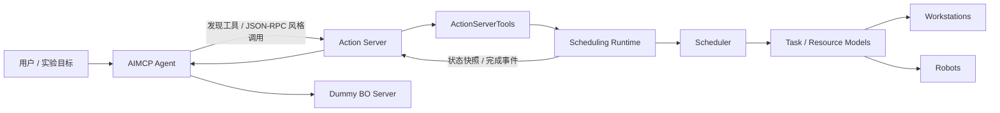
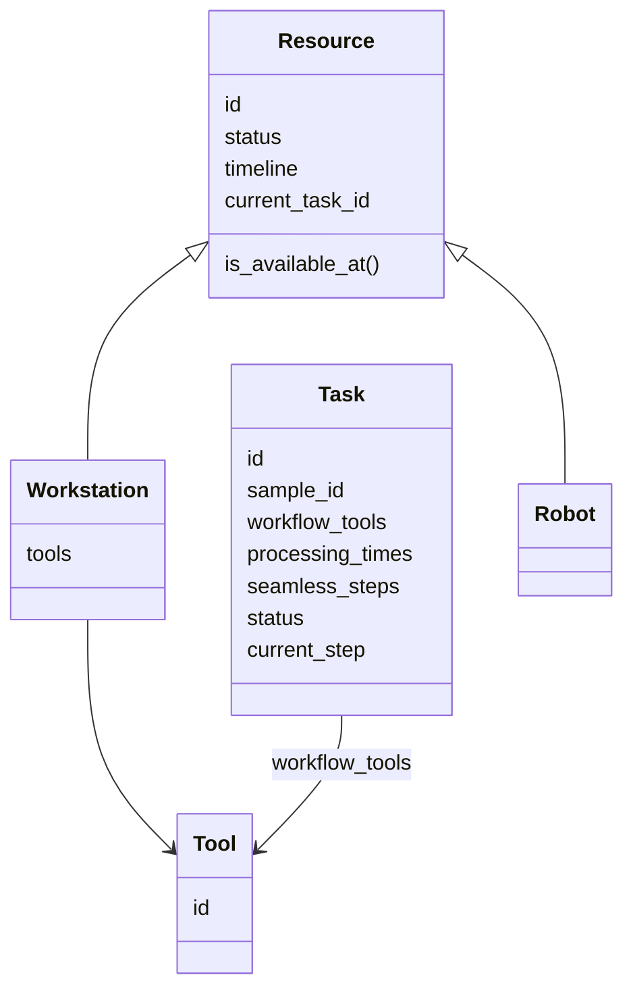
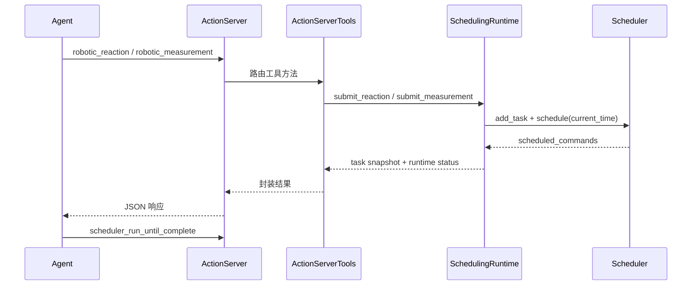

# AIMCP 接入智能调度算法原型系统

## 工程实践项目汇报

自动化实验任务编排与机器人资源调度集成

汇报内容：需求分析 / 系统设计 / 核心实现 / 测试验证 / 总结展望

---

# 目录

| 部分 | 汇报重点 |
| --- | --- |
| 项目背景与目标 | 自动化实验室场景、AIMCP 与调度模块的结合需求 |
| 需求分析与总体设计 | 功能需求、非功能需求、分层架构 |
| 核心实现 | Agent、Action Server、Scheduling Runtime、Scheduler |
| 测试与结果 | 本地闭环演示、状态推进、资源释放验证 |
| 总结与展望 | 已完成成果、当前不足、后续扩展方向 |

---

# 项目背景

自动化实验室中的实验任务通常不是单设备独立完成，而是由多个工作站、实验工具和机器人协同完成。

| 场景问题 | 具体表现 |
| --- | --- |
| 上层任务编排 | 需要根据实验目标选择工具、形成流程、调用服务 |
| 底层资源调度 | 工作站和机器人会被多个任务竞争，需要统一安排 |
| 状态反馈 | 任务执行过程中需要知道运行、等待、完成等状态 |
| 连续衔接 | 部分实验步骤完成后不能等待，需要机器人和下一工作站及时接续 |

项目目标是让 AIMCP 的工具编排能力与智能调度算法形成可运行的最小闭环。

---

# 项目目标与建设内容

## 总体目标

在已有 AIMCP 框架基础上，引入智能调度模块，实现从“上层实验动作请求”到“底层工作站与机器人调度执行”的原型链路。

## 建设内容

| 建设项 | 当前落实情况 |
| --- | --- |
| AIMCP 工具调用入口 | `AIChemMCP-main/agent.py` 可启动服务、发现工具、发起演示调用 |
| Action Server 接入 | 暴露 `robotic_reaction`、`robotic_measurement` 等动作工具 |
| 调度运行时 | 新增 `scheduling/runtime.py`，维护任务、资源和系统时间 |
| 调度算法 | 支持时间线预留、FCFS/SPT 策略入口、无缝衔接判断 |
| 本地验证 | `python agent.py` 可跑通端到端演示 |

---

# 项目资料与当前版本

| 目录 / 文件 | 作用 |
| --- | --- |
| `README.md` | 说明当前目录是“调度集成版本”，给出推荐运行入口 |
| `AIChemMCP-main/` | 已集成调度器的 AIMCP 原型工程 |
| `IntelligentScheduling-main/` | 智能调度算法参考实现与仿真入口 |
| `documents/智能调度算法说明.md` | 调度问题定义、事件驱动与前瞻预留设计 |
| `documents/AIMCP与智能调度算法模块连接方案.md` | AIMCP 与调度模块连接方案 |
| `documents/reports/` | 中期报告、工作总结等过程文档 |
| `AIChemMCP-main/software_data/` | 50 条软件工作流元数据与 JSON 工作流样例 |

---

# 需求分析

## 功能需求

- 接收来自 Agent 或上层工具调用的实验动作请求
- 将动作请求转换为调度任务对象
- 维护任务、工作站、机器人、工具等核心状态
- 根据资源占用情况生成调度命令
- 支持运行状态查询、时间推进和运行至完成
- 支持反应、测量、表征三类动作入口

## 当前边界

- 已完成本地模拟闭环
- 尚未接入真实硬件 API
- LLM 自动规划链路已有客户端代码，但演示入口默认关闭 LLM，使用固定流程验证

---

# 非功能需求分析

| 需求类型 | 设计考虑 | 当前实现依据 |
| --- | --- | --- |
| 模块化 | Agent、Server、Tools、Runtime、Scheduler 分层 | 目录分包清晰 |
| 可解释性 | 调度采用状态机与时间线，便于展示和调试 | `models.py`、`scheduler.py` |
| 可扩展性 | Action 层隔离协议，Runtime 隔离调度状态 | 可替换硬件接口 |
| 可验证性 | 提供本地演示入口和状态查询接口 | `scheduler_status`、`scheduler_run_until_complete` |
| 安全性 | 加入处理时间安全缓冲 | `safety_buffer_factor=0.1` |

---

# 系统总体架构



核心链路：`Agent -> Action Server -> ActionServerTools -> SchedulingRuntime -> Scheduler`

---

# 技术选型与开发环境

| 类别 | 技术 / 方式 | 项目中的体现 |
| --- | --- | --- |
| 开发语言 | Python | 24 个 `.py` 文件，约 2215 行源码 |
| 通信格式 | JSON / JSON-RPC 风格 | Server advertise 能力，Agent 按 method 路由 |
| 智能体接口 | MCP 风格工具调用 | 各 Server 暴露工具列表和参数 schema |
| 模型接入 | OpenAI API 客户端 | `llm_client.py`，用于后续 LLM 决策 |
| 数据建模 | dataclass + Enum | `Task`、`Resource`、`Workstation`、`Robot` |
| 过程文档 | Markdown / docx | 需求、设计、总结均有文档沉淀 |

---

# 代码目录结构

```text
项目介绍和需求--调度集成版本/
├─ README.md
├─ AIChemMCP-main/
│  ├─ agent.py
│  ├─ llm_client.py
│  ├─ run_all_servers.py
│  ├─ servers/
│  ├─ tools/
│  ├─ scheduling/
│  │  ├─ models.py
│  │  ├─ scheduler.py
│  │  └─ runtime.py
│  └─ software_data/
├─ IntelligentScheduling-main/
│  └─ src/
└─ documents/
   ├─ 智能调度算法说明.md
   ├─ AIMCP与智能调度算法模块连接方案.md
   └─ reports/
```

---

# 功能模块设计

| 模块 | 主要职责 | 关键文件 |
| --- | --- | --- |
| Agent | 启动服务、发现工具、分发调用、组织演示流程 | `agent.py` |
| Action Server | 暴露动作工具，接收并响应 JSON 请求 | `servers/action_server.py` |
| Action Tools | 将动作请求翻译为调度运行时操作 | `tools/action_server_tools.py` |
| Scheduling Runtime | 初始化实验室资源，维护时间和状态，驱动调度器 | `scheduling/runtime.py` |
| Scheduler | 候选任务选择、时间窗检查、资源预留、命令生成 | `scheduling/scheduler.py` |
| Data Models | 统一描述任务、资源、工作站、机器人、工具 | `scheduling/models.py` |

---

# 数据结构设计



项目没有独立数据库脚本；当前以 Python 对象和 JSON 数据文件承载运行状态与工作流元数据。

---

# 调度算法核心思路

## 事件驱动 + 前瞻预留

1. 工作站空闲时，从任务队列中选择可执行任务
2. 检查当前工作站时间窗是否可用
3. 对无缝衔接步骤，提前检查机器人和下一工作站
4. 可行后写入资源 `timeline`
5. 生成 `START_PROCESSING` 命令
6. Runtime 推进时间并更新任务、工作站、机器人状态

| 关键机制 | 工程意义 |
| --- | --- |
| `timeline` | 避免未来时间段资源冲突 |
| `safety_buffer_factor` | 为实验处理时长加入安全缓冲 |
| `seamless_steps` | 表达必须连续衔接的步骤约束 |
| `priority_policy` | 当前支持 FCFS，预留 SPT 扩展入口 |

---

# 核心业务流程



---

# 对外工具接口

Action Server 当前真实暴露 6 个调度相关工具：

| 工具名 | 功能 |
| --- | --- |
| `robotic_reaction` | 提交反应任务，映射到 `reaction_tool` |
| `robotic_measurement` | 提交测量任务，支持 `yield`、`ph` 类型映射 |
| `robotic_characterization` | 提交表征任务，支持 `HPLC`、`NMR` 映射 |
| `scheduler_status` | 查询当前运行时状态 |
| `scheduler_advance` | 手动推进调度时间 |
| `scheduler_run_until_complete` | 推进至任务完成或达到步数上限 |

这些接口把“实验语义”转换为“调度任务语义”，是本项目集成工作的关键接口层。

---

# 关键功能实现

| 功能点 | 实现方式 | 代码位置 |
| --- | --- | --- |
| 工具发现 | Server 启动后输出 `protocol/advertise` | `action_server.py` |
| 请求路由 | Agent 根据 method 找到对应 server | `agent.py` |
| 任务提交 | Tools 调用 Runtime 生成 `Task` | `action_server_tools.py` |
| 实验室初始化 | 3 个工作站、2 个机器人、工具映射 | `runtime.py` |
| 状态推进 | 每个 tick 更新资源状态并调用调度器 | `runtime.py` |
| 资源可用性判断 | 检查候选时间区间与 timeline 是否重叠 | `models.py` |
| 调度命令生成 | 输出 `START_PROCESSING` 命令 | `scheduler.py` |

---

# 工程化实践

| 实践点 | 体现 |
| --- | --- |
| 分层解耦 | Agent 负责编排，Action Server 负责协议，Scheduler 负责资源决策 |
| 参考实现迁移 | 将 `IntelligentScheduling-main/src` 中算法整理到 `AIChemMCP-main/scheduling` |
| 状态容器化 | 将原先仿真脚本中的状态推进逻辑抽为 `SchedulingRuntime` |
| 接口标准化 | 工具参数采用 JSON schema 风格描述 |
| 过程文档化 | 形成连接方案、算法说明、中期报告、工作总结 |
| 版本演进 | 保留参考算法工程与集成工程，便于对照说明 |

---

# 早期方案草图与实现落地


这张早期框架图体现了项目最初对 Meta Agent、软件站、硬件站、MCP Server 化和工具能力描述的设想。

当前实现已经落地其中的关键部分：Agent 发现工具、Server 暴露工具、Action 层接入调度运行时。

---

# 测试方案

| 测试层级 | 已完成验证 | 建议补充 |
| --- | --- | --- |
| 单模块 | 参考调度仿真入口可运行 | 为 Scheduler 增加单元测试 |
| 集成链路 | `python agent.py` 跑通 Agent 到 Scheduler | 增加多步任务链自动化测试 |
| 接口调用 | 验证 6 个 Action 工具可被发现和调用 | 增加异常参数测试 |
| 状态推进 | 验证 `RUNNING -> COMPLETED` 和资源释放 | 增加机器人转运与无缝衔接案例 |
| 回归验证 | 手动运行演示流程 | 后续接入 pytest 或 CI |

说明：当前项目没有独立测试目录，测试以本地演示和文档案例为主。

---

# 已完成测试结果

本次在 `AIChemMCP-main/` 下运行：

```powershell
python agent.py
```

观察到的真实结果：

| 验证点 | 结果 |
| --- | --- |
| 服务启动 | BO Server、Action Server 启动成功 |
| 工具发现 | BO Server 6 个工具，Action Server 6 个工具，共 12 个 |
| 任务提交 | 反应任务 `TASK-0001`、测量任务 `TASK-0002` 被受理 |
| 运行状态 | 两个任务进入 `RUNNING`，对应工作站进入 `BUSY` |
| 完成状态 | `scheduler_run_until_complete` 后 `all_completed=true` |
| 资源释放 | 3 个工作站、2 个机器人最终均回到 `IDLE` |

完成事件：测量任务在时间 68 完成，反应任务在时间 199 完成。

---

# 问题修复与当前限制

| 类型 | 当前情况 | 处理方式 |
| --- | --- | --- |
| 原始工具空实现 | Action Tools 原先不承担真实动作 | 已改为调用 `SchedulingRuntime` |
| 调度逻辑与脚本耦合 | 参考算法主要在 `main.py` 仿真 | 已抽出 `models/scheduler/runtime` |
| BO / Prediction 等模块 | 部分工具仍是占位或参考性质 | PPT 中按“扩展模块”表述，不夸大 |
| 数据持久化 | 没有数据库或持久化状态表 | 当前定位为内存态原型，后续可接数据库 |
| 硬件闭环 | 未接真实设备 ACK | 当前为本地模拟，后续扩展真实回执 |
| 自动规划 | LLM 客户端存在，但演示默认关闭 | 当前以固定流程验证系统链路 |

---

# 项目亮点

1. 完成了从文档设计到代码集成的闭环，而不只是单独写算法或单独写接口。
2. 将 AIMCP 的上层工具调用和调度算法的底层资源分配进行了职责拆分。
3. 调度器采用时间线和前瞻预留方式，能够解释资源冲突和无缝衔接约束。
4. Runtime 将本地仿真逻辑服务化，为后续真实硬件接口接入预留位置。
5. 项目保留了说明文档、中期报告和工作总结，工程过程材料较完整。
6. 通过本地演示验证了任务提交、状态推进、任务完成和资源释放。

---

# 项目成果展示

| 成果类型 | 内容 |
| --- | --- |
| 可运行原型 | `AIChemMCP-main/agent.py` 可执行端到端演示 |
| 集成代码 | `scheduling/` 包、Action Tools、Action Server 已接通 |
| 调度能力 | 支持工作站、机器人、任务队列、时间线、状态推进 |
| 工具接口 | 反应、测量、表征、状态查询、时间推进、运行至完成 |
| 数据资源 | 50 条软件工作流元数据，10 个工作流详情 JSON |
| 文档材料 | 算法说明、连接方案、中期报告、工作总结 |

当前成果定位：面向自动化实验任务调度的本地原型系统。

---

# 适合进一步画图和展示的内容

| 可视化内容 | 推荐形式 | 对应依据 |
| --- | --- | --- |
| 系统架构 | 分层架构图 | 连接方案文档、当前目录结构 |
| 工具调用链 | 时序图 | `agent.py`、`action_server.py` |
| 数据模型 | 类图 | `scheduling/models.py` |
| 调度流程 | 流程图 | `scheduling/scheduler.py` |
| 状态流转 | 状态机图 | `runtime.py` |
| 测试流程 | 测试闭环图 | `python agent.py` 输出 |

后续汇报时建议补充一张 VS Code 运行截图和一张终端结果截图，用于增强“真实跑过”的直观感。

---

# 总结与展望

## 项目总结

本项目围绕自动化实验室任务执行场景，完成了 AIMCP 工具编排层与智能调度层的初步集成。当前版本已经形成从工具发现、动作提交、调度运行、状态查询到任务完成的可运行闭环。

## 后续展望

- 扩展 `reaction -> measurement -> characterization` 的多步任务链
- 补充 pytest 单元测试和集成测试
- 接入真实硬件接口或仿真平台 ACK 机制
- 引入数据库持久化任务、资源与运行日志
- 让 LLM 根据调度状态进行下一步自动决策
- 完善异常处理、重调度和任务优先级策略

